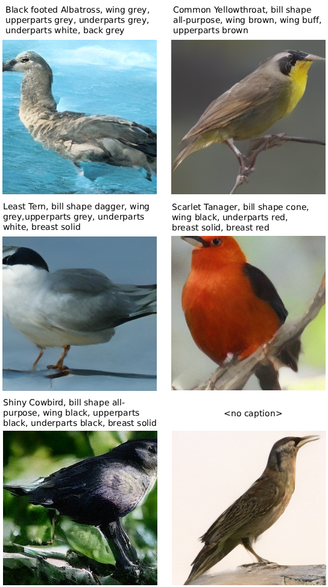
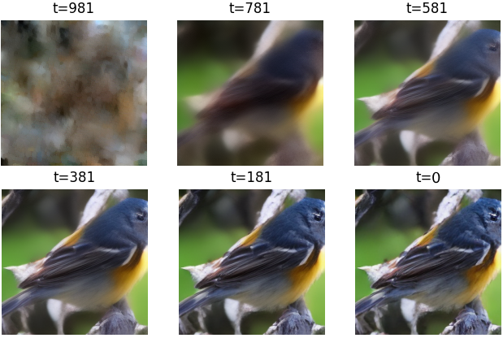

# Latent Text-to-Image Diffusion (CUB-200)

A PyTorch implementation of a **latent diffusion model (LDM)** trained on the **CUB-200-2011 bird dataset**, conditioned on natural language captions.

The model combines a VAE, CLIP text encoder, and a U-Net diffusion model to generate images from text prompts.

---

## Features

- Latent Diffusion Model (Stable Diffusion-style pipeline)
- CLIP-based text conditioning
- Custom U-Net with attention (SOTADiffusion)
- DDPM + DDIM sampling
- Exponential Moving Average (EMA)
- Mixed precision training (AMP)
- Caption dropout (classifier-free guidance)
- Modular architecture (encoder, diffusion, sampling)
- Local GUI for interactive generation

---

## Results

The model generates **bird images from text descriptions** using learned visual-text alignment.

<p align="center">
  
</p>

<p align="center">
  
</p>
---

## Diffusion Sampling

Images are generated using **DDIM sampling in latent space**.

- Starts from Gaussian noise in latent space
- Iteratively denoised over T timesteps
- Decoded using VAE into RGB image

---

## Repository Structure
```
project/
│ main.py
│ README.md
│
├── src/
│ ├── autoencoder/ # VAE model + training
│ ├── diffusion/ # training, sampling, schedules
│ ├── unet/ # diffusion model (U-Net)
│ ├── blocks/ # ResBlocks, up/down sampling
│ ├── embedding/ # timestep embeddings
│ ├── load/ # dataset loaders (CUB)
│ ├── utils/ # helpers (config, saving)
│ └── app.py # GUI interface
│
├── configs/
│ ├── autoencoder.yaml
│ ├── model.yaml
│ └── data.yaml
│
└── data/
└── CUB_200_2011/
```

## Requirements

- Python 3.10+
- PyTorch (CUDA recommended)
- torchvision
- transformers
- diffusers
- tqdm
- pillow
- pyyaml

Install dependencies:

```bash
pip install torch torchvision transformers diffusers tqdm pillow pyyaml
```

## GUI

The project includes a Tkinter-based local interface.

Features:

- Enter text prompt
- Generate images in real time
- Displays output image
- Uses DDIM sampling

Notes:

- Designed for 256×256 resolution
- Latent scaling factor: 0.18215
- EMA model is used for inference
- Caption dropout improves conditioning robustness

Future Improvements
- Gradio / web interface
- Adjustable sampling controls (steps, CFG scale)
- Multi-model comparison UI
- Higher resolution training
- Better prompt alignment

## References

Latent Diffusion Models: Rombach et al., 2022, https://arxiv.org/abs/2112.10752

DDPM: Ho et al., 2020, https://arxiv.org/abs/2006.11239

Improved DDPM: Nichol & Dhariwal, 2021, https://arxiv.org/abs/2102.09672

CLIP: Radford et al., 2021, https://arxiv.org/abs/2103.00020
